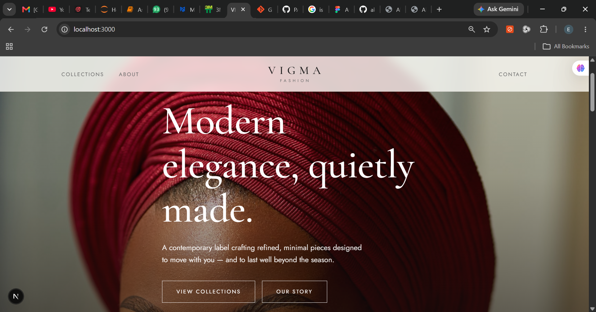
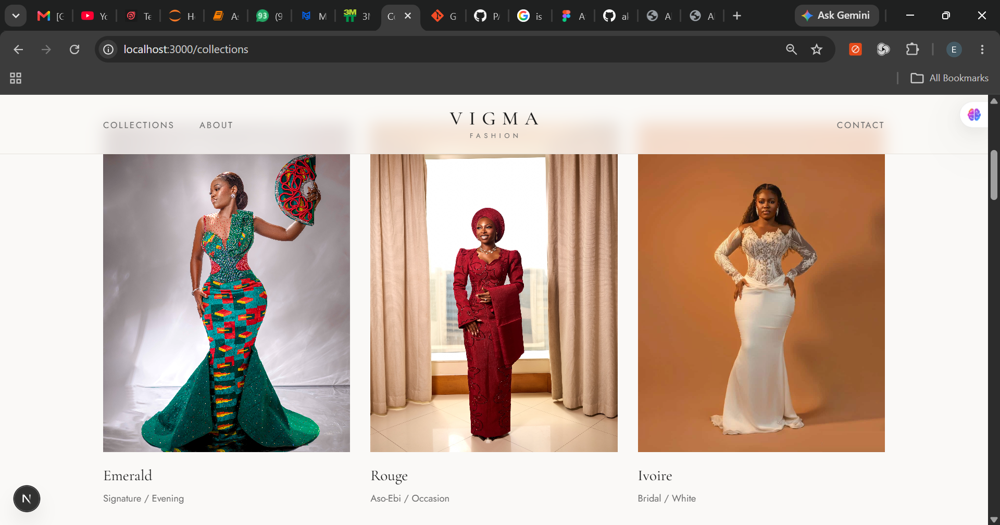
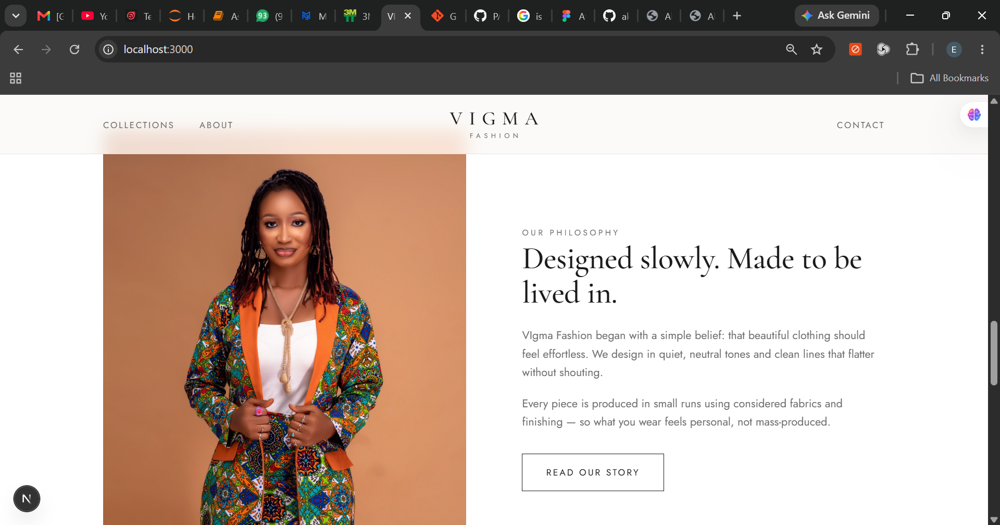

# Vigma Fashions

A modern and elegant fashion showcase and lookbook website built for **Vigma Fashions**, with a clean, minimal design focused on presenting fashion collections and the brand identity.

## ✨ Features

* Responsive design for desktop and mobile
* Modern fashion-focused user interface
* Hero section with brand presentation
* Featured fashion collections
* Collection and lookbook pages
* About page with brand story and values
* Contact/inquiry page
* Responsive navigation with mobile menu
* Reusable React components
* Optimized image assets
* Clean and maintainable project structure

## 🛠️ Technologies Used

* **Next.js** — React framework
* **React** — Frontend library
* **JavaScript**
* **CSS**
* **Node.js / npm**

## 📂 Project Structure

```text
vigma-fashion/
│
├── app/
│   ├── about/
│   │   └── page.js
│   ├── collections/
│   │   └── page.js
│   ├── contact/
│   │   └── page.js
│   ├── globals.css
│   ├── layout.js
│   ├── not-found.js
│   └── page.js
│
├── components/
│   ├── CollectionCard.js
│   ├── ContactForm.js
│   ├── Footer.js
│   └── Navbar.js
│
├── data/
│   └── collections.js
│
├── public/
│   └── images/
│
├── package.json
├── next.config.mjs
├── jsconfig.json
└── README.md
```

## 🚀 Getting Started

### 1. Clone the repository

```bash
git clone https://github.com/akehmmy/Vigma-Fashions.git
```

### 2. Navigate into the project

```bash
cd Vigma-Fashions
```

### 3. Install dependencies

```bash
npm install
```

### 4. Start the development server

```bash
npm run dev
```

Open **http://localhost:3000** in your browser.

## 🏗️ Build for Production

```bash
npm run build
npm start
```

## 🎨 Customization

### Add or change images

Place images inside:

```text
public/images/
```

Collection information can be managed from:

```text
data/collections.js
```

### Change colors and styling

The main design tokens and styling can be found in:

```text
app/globals.css
```

### Update brand content

Page content can be edited within the files inside:

```text
app/
```

## 📩 Contact Form

The current contact form opens the visitor's default email application with a pre-filled message.

It can be extended in the future with a backend API or a form service for automatically collecting inquiries.

## 🌐 Deployment

The project can be deployed using platforms such as **Vercel** or **Netlify**.

## 📸 Screenshots

Screenshots of the website can be added here to showcase the user interface and different pages of the project.

### Homepage



### Collections



### About


## 👨‍💻 Developer

**Akor Emmanuel**

Computer Science Graduate | Python Developer | Aspiring Software Developer

GitHub: https://github.com/akehmmy

---

⭐ If you find this project useful or interesting, consider giving the repository a star.
